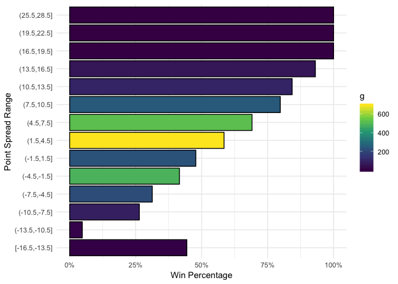

## Load data


```r
poss <- read_csv("~/Dropbox/ArmchairAnalysis/nfl_00-17/PBP.csv")
game <- read_csv("~/Dropbox/ArmchairAnalysis/nfl_00-17/GAME.csv")

recent_games <- filter(game, seas >= 2008)
pxp <- left_join(recent_games, poss)

# rm(game, poss, recent_games)
# gc()
```

## How often do teams who score first win?


```r
# approx 57% of the time
pxp %>% 
  filter(ptsh != ptsv) %>% 
  filter(abs(pts) <= 8, ptso == 0, ptsd == 0) %>% 
  select(gid, pts, ptso, ptsd, ptsh, ptsv, sprv) %>% 
  mutate(score_first = ifelse(pts > 0, 1, -1),
         win = ifelse(ptsh > ptsv, 1,-1)) %>% 
  summarise(games = n(),
            scr1_win = sum(score_first == win)/games)
```

```
## # A tibble: 1 x 2
##   games scr1_win
##   <int>    <dbl>
## 1  2664    0.567
```

## Team score first wins grouped by spread


```r
# Team Score First Win by Point Spread
pxp %>% 
  filter(ptsh != ptsv) %>% 
  filter(abs(pts) <= 8, ptso == 0, ptsd == 0) %>% 
  select(gid, pts, ptso, ptsd, ptsh, ptsv, sprv) %>% 
  mutate(score_first = ifelse(pts > 0, 1, -1),
         win = ifelse(ptsh > ptsv, 1,-1)) %>% 
  group_by(sprv) %>% 
  summarise(games = n(),
            scr1_win = round(sum(score_first == win)/games,3)) %>% 
  ungroup() %>% 
  select(Spread = sprv, Games = games, TeamScr1Wins = scr1_win) %>% 
  knitr::kable()
```


 Spread   Games   TeamScr1Wins
-------  ------  -------------
  -14.5       2          0.500
  -14.0       2          0.500
  -13.5       5          0.400
  -13.0       1          0.000
  -12.0       1          0.000
  -11.5       2          0.000
  -11.0       6          0.167
  -10.5      11          0.000
  -10.0      17          0.353
   -9.5      15          0.200
   -9.0      19          0.105
   -8.5       5          0.400
   -8.0      12          0.417
   -7.5      19          0.263
   -7.0      58          0.241
   -6.5      42          0.381
   -6.0      33          0.303
   -5.5      28          0.321
   -5.0      21          0.238
   -4.5      32          0.406
   -4.0      33          0.333
   -3.5      88          0.364
   -3.0     225          0.400
   -2.5      69          0.522
   -2.0      40          0.450
   -1.5      28          0.500
   -1.0      72          0.347
   -0.5       1          0.000
    0.0      18          0.444
    1.0      90          0.556
    1.5      47          0.553
    2.0      34          0.412
    2.5     119          0.588
    3.0     268          0.560
    3.5     137          0.620
    4.0      67          0.657
    4.5      67          0.627
    5.0      43          0.488
    5.5      58          0.621
    6.0      76          0.658
    6.5     106          0.745
    7.0     162          0.759
    7.5      72          0.667
    8.0      23          0.783
    8.5      22          0.727
    9.0      65          0.769
    9.5      42          0.786
   10.0      56          0.821
   10.5      39          0.872
   11.0      14          0.929
   11.5      12          0.833
   12.0      16          0.875
   12.5      12          0.750
   13.0      22          0.818
   13.5      26          0.846
   14.0      28          0.893
   14.5      10          1.000
   15.0      10          0.900
   15.5       4          1.000
   16.0       1          1.000
   16.5       5          1.000
   17.0       3          1.000
   19.0       1          1.000
   20.5       1          1.000
   26.5       1          1.000

## Score first win by spread group


```r
df <- pxp %>% 
  filter(ptsh != ptsv) %>% 
  filter(abs(pts) <= 8, ptso == 0, ptsd == 0) %>% 
  select(gid, pts, ptso, ptsd, ptsh, ptsv, sprv) %>% 
  mutate(score_first = ifelse(pts > 0, 1, -1),
         win = ifelse(ptsh > ptsv, 1,-1)) %>% 
  group_by(sprv) %>% 
  summarise(games = n(),
            scr1_win = sum(score_first == win)) %>% 
  ungroup() %>% 
  select(Spread = sprv, Games = games, TeamScr1Wins = scr1_win) %>% 
  group_by(spr = cut_width(Spread, width=3,closed = "right")) %>% 
  summarise(g = sum(Games), w = sum(TeamScr1Wins), wpct = round(w/g,3))

ggplot(df, aes(spr, wpct,fill=g)) +
  geom_bar(stat = 'identity', color = 'black') +
  coord_flip() +
  scale_y_continuous(labels = scales::percent_format()) + 
  scale_fill_viridis_c() +
  labs(x = 'Point Spread Range', y = 'Win Percentage',f='Games') +
  theme_minimal()
```

<!-- -->


